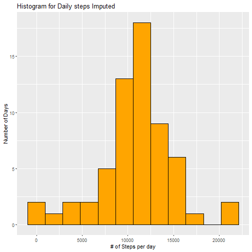

## Steps Analysis

This report analyses the steps monitor data collected from one person over multiple days.  

#### Step 1: We will unpack original data file, read data into R and convert date into Date format.  


```r
library(dplyr)
library(ggplot2)
## unzip("activity.zip")
activity <- read.csv("activity.csv", header=TRUE)
activity <- mutate(activity, date = as.Date(date, format="%Y-%m-%d"))
```
  
  
#### Step 2: Sum up daily steps, calculate mean and median of steps per day  

We will sum steps by date, then plot a histogram of it  


```r
activity %>% group_by(date) %>% summarize(dailysteps = sum(steps, na.rm=TRUE)) -> dailysteps
```

```
## `summarise()` ungrouping output (override with `.groups` argument)
```

```r
p1 <- qplot(dailysteps$dailysteps, geom="histogram", bins=12, 
      main="Histogram for Daily steps", xlab = "# of Steps per day", 
      ylab="Number of Days", fill = I("Steelblue"), col=I("red"))
mean <- mean(dailysteps$dailysteps)
median <- median(dailysteps$dailysteps)
```
Histogram of daily steps taken is as following:  


  
The mean of total steps taken per day is 9354.2295082  
The median of total steps taken per day is 10395  
  
#### Step 3: What is the average daily activity pattern?   
We will group data by interval number, then calculate average steps per interval.    
  

```r
activity %>% group_by(interval) %>% summarize(steps= mean(steps, na.rm=TRUE)) -> intervalsteps
```

```
## `summarise()` ungrouping output (override with `.groups` argument)
```

```r
p2 <- ggplot(intervalsteps, aes(x = interval, y=steps)) + geom_line(color="blue")
```
  
Average steps per interval over days plot:  

  
Interval with maximum average steps is 835  
  
#### Step 4: Imputing missing values  
Total number of records with missing values is 2304  
Percentage of records with missing values is 0.1311475  
  
We are going to fill in missing value with mean of 5 minute interval steps computed in step 3. Then we will re-calculate sum of daily steps.  


```r
filled <- data.frame(activity)
whichna <- which(is.na(filled$steps))
for( val in whichna){
  itv <- filled[val, 3]
  filled[val, 1] <- intervalsteps[intervalsteps$interval==itv, 2]
}

filled %>% group_by(date) %>% summarize( stepsPerDay = sum(steps, na.rm=TRUE)) -> imputed
```

```
## `summarise()` ungrouping output (override with `.groups` argument)
```

```r
p3 <- qplot(imputed$stepsPerDay, geom="histogram", bins=12, 
      main="Histogram for Daily steps Imputed", xlab = "# of Steps per day", 
      ylab="Number of Days", fill = I("Orange"), col=I("black"))
imputedmean <- mean(imputed$stepsPerDay)
imputedMedian <- median(imputed$stepsPerDay)
```
  
Histogram of Daily number of steps with imputed data is as following:  

  
The mean of total steps taken per day is 1.0766189 &times; 10<sup>4</sup>    
The median of total steps taken per day is 1.0766189 &times; 10<sup>4</sup>  
  
#### Step 5: Acitvity pattern comparison between weekdays and weekends  
Using imputed dataset, compute average number of steps per interval for weekdays and weekends. Plot them in two panels vertically to visualize.  


```r
weekends <- c("Saturday", "Sunday")
twopattern <- mutate(filled, ifweekend = ( weekdays(date) %in% weekends))
twopattern %>% group_by(interval, ifweekend) %>% summarize(steps= mean(steps, na.rm=TRUE)) -> newstep
```

```
## `summarise()` regrouping output by 'interval' (override with `.groups` argument)
```

```r
p4 <- ggplot(newstep, aes(x = interval, y=steps), group=ifweekend)
p4 <- p4 + geom_line(aes(color=ifweekend)) + geom_point(aes(color=ifweekend))
p4 <- p4 + facet_grid(ifweekend ~ .)
print(p4)
```


  
